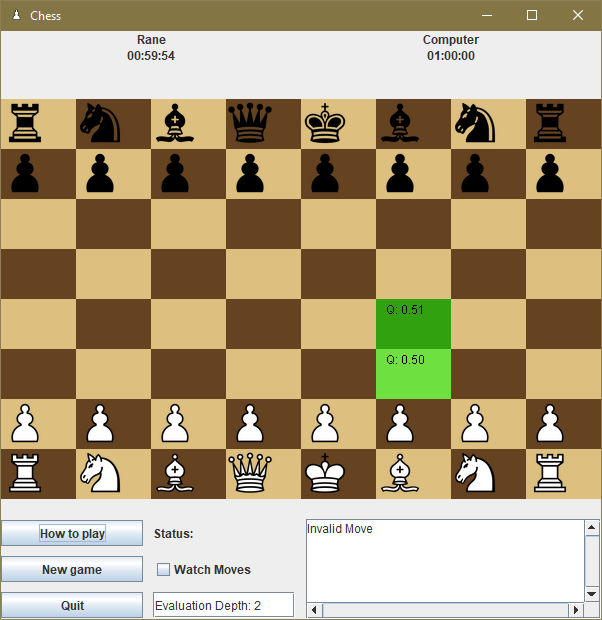
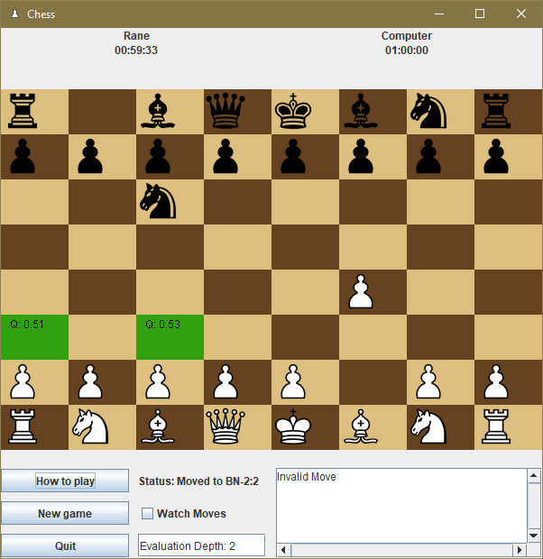

# 4800-ChessGameML- Assignment 2

**Project by Rane Dy**

 

## Requirements 

This Chess game utilizes machine learning for suggesting next moves:  
- Machine Learning to evaluate the current and next board position and provide a result between 0 and 1 to suggest if this is a good move to take
- Used dataset found from kaggle: https://www.kaggle.com/datasets/antoinecastel/fen-to-stockfish-evaluation/data
-  training a convolutional neural network (CNN) to evaluate chess positions based on FEN (Forsyth–Edwards Notation) strings and predict a numerical evaluation score (like a simplified Stockfish score, normalized)
-  Exports the model to ONNX format as model.onnx for deployment and ability to use model with Java UI
---

### Dataset Results:
- *Samples*: Randomly samples 80,000 FEN positions from the CSV
- *R2 Score*: 0.3645
- *Mean Absolute Error*: 0.0389
---

## 🚀 Potential Next Steps  

- In the future, I want to improve the model to have better metrics and accuracy! This will help improve in-Game decisions due to more precise position predictions. 

---

## 💻 Installation  

### Prerequisites:  
- Downloaded Chess.zip from canvas to utilize Chess GUI
- Download Dataset from Kaggle: https://www.kaggle.com/datasets/antoinecastel/fen-to-stockfish-evaluation/data
  
---
